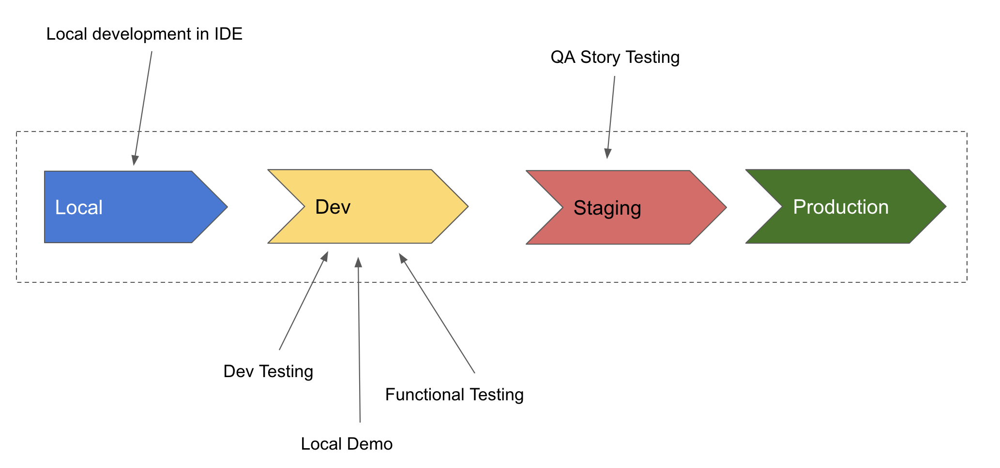
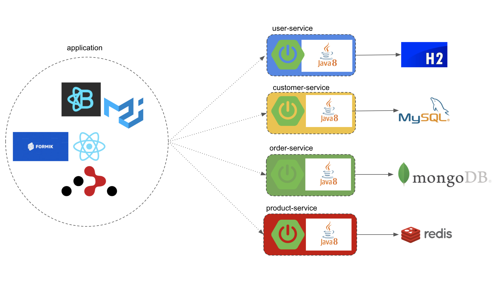
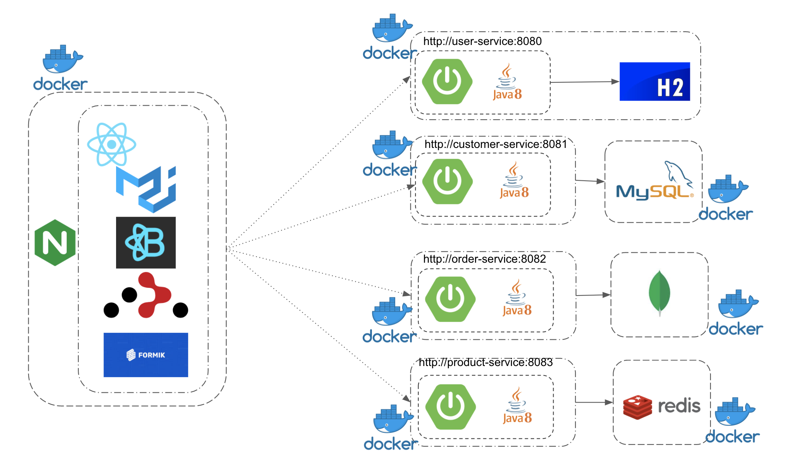

# Sales Order System 2.0

__Sales Order System 2.0__ is a 2020 epic software application development project produced by Colin But. It is a direct sequel to [Sales Order System](http://github.com/colinbut/sales-order-system) (2015).

Just like the first installment, this project aims to be a complete personal side project of mine and thus aimed for demo purposes. 

__Therefore, this project is on-going, and is still on-going, always WIP, never finished and will never ever be classified as 'finished'.__

However, current project status is at a __"Complete Enough"__ status. 
_Because of this status, this project is sort of workable and demo-able but will have obvious signs of incompleteness & a few bugs here & there._

This project is an evolution of the first where the first project demoed a now more traditional Java/J2EE Spring Web MVC, Server Side Rendering, JSP "monolithic" application. 

Evolutions showcases are more modern approach to web app development, fully embracing a microservices architecture using much modern (in 2020) cutting edge technologies [Java 8, Spring Boot, React, Docker].

## Table of Contents

  - [Project Modes](#project-modes)
  - [Software Architecture](#software-architecture)
  - [System Architecture](#system-architecture)
  - [Running Application](#running-application)
  - [Demo](#demo)
  - [Project Development](#project-development)
    - [Backend](#backend)
      - [Unit Test](#unit-test)
      - [Integration Test](#integration-test)
      - [Component Test](#component-test)
      - [End 2 End Test](#end-2-end-test)
      - [Code Quality Analysis - SonarQube](#code-quality-analysis---sonarqube)
    - [Frontend](#frontend)
  - [RoadMap](#roadmap)
  - [Frontend Aggregration](#frontend-aggregration)
  - [Microservice Orchestration](#microservice-orchestration)
    - [Entity Driven Microservices](#entity-driven-microservices)
    - [Activity Driven Microservices](#activity-driven-microservices)
  - [Technologies Overview](#technologies-overview)
  - [Screenshots](#screenshots)
  - [Appendix](#appendix)
    - [Port Mappings](#port-mappings)

## Project Modes

This project has different modes:


| Mode         | Description                                | Environment Mapping             |
|:-------------|:-------------------------------------------|:--------------------------------|
| Local        | for local development, using IDE           | localhost/local machine         |
| Development  | for local dev/functional testing / Demo    | Docker Compose on local machine |
| Staging      | for QA story testing                       | [TBD]                           |
| Production   | Actual Use                                 | [TBD]                           |

The above modes maps to the project development lifecycle as specified in each microservices.



## Software Architecture

Each business domain is segregated into their own microservices which exposes RESTful API endpoints for the client to consume. The UI is built using the React UI library with its ecosystem of sibing tools for constructing UI components, client side routing, forms, form validations etc.



## System Architecture

The following shows a high level architecture of the full system:



Each backend microservice & its associated data storage components are dockerized. The frontend client application is served as static files using NGINX as a http server which is then bundled up into a Docker container too.

## Running Application

There are few helper bash utility helper scripts in this root project level that can start either frontend app (`start-frontend-client.sh`), backend microservices (`start-backend-services.sh`) or both which is a full stack app setup (`start-fullstack-app.sh`).

__Start Frontend App__
```bash
./start-frontend-client.sh
```

__Start Backend Services__
```bash
./start-backend-services.sh
```

__Start Fullstack Application:__
```bash
./start-fullstack-app.sh
```

These are wrapper bash scripts around __Docker Compose__.

## Demo

[TDB]

## Project Development
This following section describes various aspects of the project's development covering:

- testing
  - unit test
  - integration test
  - end 2 end/ component test
- static code analysis
- ui development
  

### Backend

The backend is broken up into multiple smaller fine grained size microservices.
Each business functionality is broken into their own 'domain'. A technique of context boundaries from DDD (Domain Driven Design) is used to come to this conclusion:

| Microservice     | Domain             |
|:-----------------|:-------------------|
| User Service     | User Domain        | 
| Customer Service | Customer Domain    | 
| Order Service    | Order Domain       | 
| Product Service  | Product Domain     | 

#### Unit Test

Use [JUnit 5](https://junit.org/junit5/) coupled with [Mockito](https://site.mockito.org/) to mock dependencies for unit testing.

Both JUnit & Mockito comes pre-bundled with Spring Boot.

See individual backend microservices sub-project for more details.

#### Integration Test

This project demonstrates 2 types of integration tests:

1. Repositpory integration tests
2. API integration tests

__Repository Integration Tests__

Aims to tests the integration of the Spring Data Repositories against its Database/Datastore.

__API Integration Tests__

Another type of integrations which is a bit more fullstack integration in terms of the backend is concerned, where it fires up a full microservice along with its backed Database/Datastore and API requests are made & thus verified using [Rest Assured](http://rest-assured.io/).

This type of integration can also be viewed as a type of End 2 End / Component Testing.

#### Component Test

If you view a backend microservice as a complete "Component" then theorectically, the API Integration Tests mentioned above can be treated as a "Component Test" but then all of this is just a matter of definement of terminology and personal classification/judgement of the type of tests in the [Testing Pyramid](https://medium.com/@Colin_But/define-testing-strategy-using-the-testing-pyramid-1dabee37e823).

#### End 2 End Test

Unlike in Sales Order System where it demonstrates the use of a BDD testing tool [Cucumber](https://cucumber.io/) to showcase testing a monolithic application end to end, here I don't.

As a matter of judgement for this project, because of the microservice nature of this full system, to constitute end 2 end then that would probably mean from frontend to various backend microservices.

In a microservice architecture, I believe this should be ideally replaced by either using something like Selenium or better: manual QA testing.

#### Code Quality Analysis - SonarQube

Currently this project does not demonstrates static code quality analysis but I do plan to integrate [SonarQube](https://www.sonarqube.org/) into the backend microservices in due course.

### Frontend

Unlike its predecessor, Sales Order System 2.0 does not do server side rendering of frontend HTML views. Instead, the frontend is built as an independent client and treated as a "Application" as such.

It is constructed entirely using React - a UI library, along with several other frontend components from the React ecosystem. This React frontend application was bootstrapped by [Create-React-App](https://create-react-app.dev/). A helper project that helps setting up React projects quick and fast.

It is a "thick" client and is built as a static site mainly using React Router to achieve client side routing.

For more in-depth details of this, see the frontend sub project - Sales Order System.

## RoadMap

1. Introduction of an Edge Service
   1. (At the moment, there's no orchestration logic at all at both the backend & frontend but just frontend aggregation. The plan is to put in place backend orchestration - see below.)
2. Put in place an API Gateway
   1. (Addition or replacement of Edge Service, where this API Gateway will perform more advanced routing of requests from frontend to the different backend microservices - more suitable for staging & production)
3. UI improvements
4. Staging & Production definement

## Frontend Aggregration

At the moment, the React front end UI client just calls interacts with various different backend microservices separately, getting the response back directly from them. Need a much better & looser coupling solution.

Logic is needed for the application to do validation. This orchestration logic should ideally not be in frontend but preferrably in the backend. Also, avoid doing it in the API Gateway if the plan is to put in place one. See below for more info on Orchestration.

## Microservice Orchestration

As mentioned above, ideally logic orchestration should happen in the backend microservices. At the moment, all microservices are "entity-driven".

### Entity Driven Microservices

Another name for microservices CRUD wrappers. Minimal to No logic at all. In a fully microserviced architecture, we should ideally prefer "activity-driven" microservices instead.

### Activity Driven Microservices

As name suggests this is where most logic orchestration should happen. Let's hope to have more of these. But in a realistic software world, we should have both a good combination of both _entity driven microservices_ and _activity driven microservices_.

## Technologies Overview

- Frontend:
  - React
  - React Router
  - Material-UI
  - MaterialTable
  - React Bootstrap
  - Create-React-App
  - Formik
  - Yup
  - Npm
  - Clsx
- Backend:
  - Java 8
  - Spring Boot
    - Spring Data:
      - Spring Data JPA
      - Spring Data Mongo
      - Spring Data Redis
    - Spring Security
      - JWT
  - Swagger
  - Rest Assured
  - TestContainers
- Database:
  - MySQL
  - MongoDB
  - Redis
  - H2
- DevOps:
  - Docker
  - Docker Compose
  - Jenkins
  - Maven
  - Gradle

## Screenshots

[TBD]

## Appendix

### Port Mappings

| Microservice     | Port |                  
|:-----------------|:-----|
| User Service     | 8080 | 
| Customer Service | 8081 | 
| Order Service    | 8082 | 
| Product Service  | 8083 |